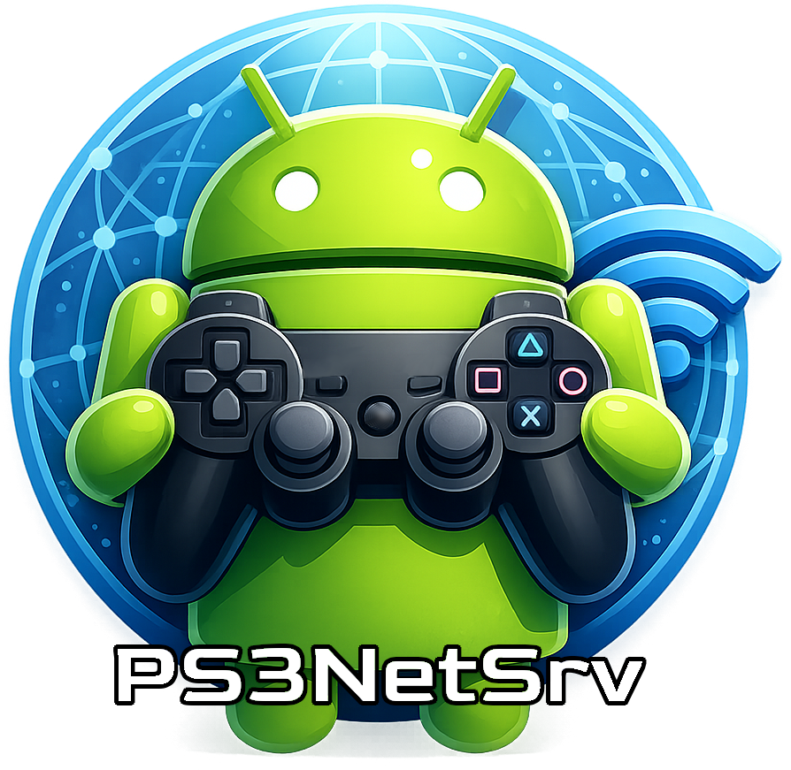
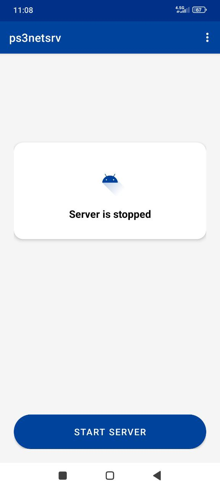
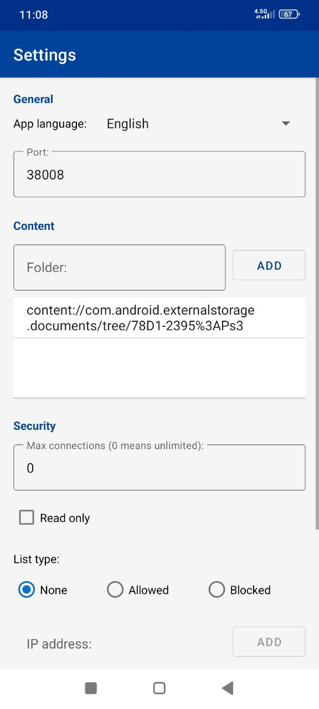

  

# PS3NetSrv for Android

This is an Android implementation of the `ps3netsrv` server, allowing you to stream ISOs and other media files to your PlayStation 3 directly from your Android device.

> [!TIP]
> **Performance Tip:** For the best streaming performance and to avoid lag or stuttering, it is highly recommended to connect your PS3 to the network using a **wired LAN cable** instead of Wi-Fi.

## Features

- **Digital Media Streaming:** Stream PS3 ISOs and media files over the local network (WebMAN MOD / multiMAN compatible).
- **Virtual ISO Support:** Stream game folders (JB format) directly as virtual ISOs. The server dynamically generates the ISO 9660 structure.
- **Multipart ISO Support:** Seamlessly handle split ISO files (e.g., .iso.66600, .iso.66601) as a single file.
- **Multiple Folders:** Support for serving files from multiple directories on your device.
- **Ordered Priority:** If a file exists in multiple folders, the one in the first listed folder takes priority.
- **Port Configuration:** Customizable server port (Default: 38008).
- **Connection Limits:** Set a maximum number of connected clients.
- **Security:**
  - **IP Whitelist/Blacklist:** Restrict access to specific IP addresses.
  - **Read-Only Mode:** Prevent clients from deleting or modifying files on your device.
- **Persistent Service:** Option to keep the server running in the background with a persistent notification (Android 13+ supported).
- **Multilingual:** Available in English, Portuguese, Spanish, Italian and Ryukyuan.

## How to Use

1.  **Grant Permissions:** Upon first launch, grant the necessary storage permissions so the app can access your game files. On Android 13+, also grant notification permissions to ensure the service runs reliably in the background.
2.  **Add Folders:**
    - Tap "Add folder" (or "Adicionar pasta").
    - Navigate to the directory containing your PS3 content (e.g., `GAMES`, `PS3ISO`, `DVDISO`).
    - You can add multiple folders. The order matters for file priority.
3.  **Configure (Optional):**
    - Tap the **Settings** (Configurações) icon in the menu.
    - **Port:** Change the listening port if needed.
    - **IP Filtering:** Set up a whitelist/blacklist if you want to secure access.
    - **Max Connections:** Limit how many devices can connect simultaneously.
4.  **Start Server:**
    - Return to the main screen.
    - Tap **Start Server** (Iniciar servidor).
    - The status will update to show the running port and IP address.
5.  **Connect from PS3:**
    - On your PS3 (running WebMAN MOD or multiMAN), configure the `ps3netsrv` settings to point to your Android device's IP address and the port you configured (default 38008).

## Tutorial & Folder Structure

To ensure your games are recognized correctly, you must organize them into specific folders within your shared directories.

### Supported Folders

| Folder | Content Type | Supported Formats |
| :--- | :--- | :--- |
| **`PS3ISO`** | PS3 Games | `.iso` |
| **`GAMES`** | PS3 Games (JB Folder) | Folders containing `PS3_GAME` (Virtual ISO) |
| **`GAMEZ`** | PS3 Games | Simulates games installed inside the PS3 (needs write permissions) |
| **`PS2ISO`** | PS2 Games | `.iso` |
| **`PSXISO`** | PS1 Games | `.iso`, `.bin/.cue` |
| **`PSPISO`** | PSP Games | `.iso` |
| **`BDISO`** | Blu-ray Movies | `.iso` |
| **`DVDISO`** | DVD Movies | `.iso` |
| **`PKG`** | Application Packages | `.pkg` |
| **`GAMEI`** | PSN Content | Folder to store PSN games extracted from packages |

### Advanced Features

#### Virtual ISO (JB Folders)
You don't need to convert your "JB format" folders (the ones with `PS3_GAME` inside) to ISO. Just place them in the `GAMES` folder. PS3NetSrv for Android will automatically present them to the PS3 as virtual ISOs.

#### Multipart ISOs (Split Files)
If you have large ISO files split into parts (e.g., to fit on FAT32), the server handles them automatically. Ensure they follow this naming convention:
- `GameName.iso.66600`
- `GameName.iso.66601`
- ...and so on.
The console will see and mount them as a single, complete ISO.

### Setting Up Your PS3

1.  **Get Device IP:** Note the IP address displayed on the app's main screen after starting the server.
2.  **WebMAN MOD:**
    - Go to **webMAN Setup** -> **PS3 webMAN [Setup]**.
    - Scroll down to **Scan for games** and check the **Scan for LAN games/videos** option.
    - Enter your Android device's IP and Port (default `38008`) in the server slots.
    - Click **Save** and restart your console.
3.  **MultiMAN:**
    - Go to the **Network** column.
    - Select **Network Servers**.
    - Configure a new server with your Android IP and Port.

---

## Screenshots

| Main Screen | Settings |
|:---:|:---:|
|  |  |
| **Server Status & Folder List** | **Configuration Options** |

## About

- **Developer:** Jhonathan Corrêa
- **Thanks to:** Aldostools (for the original concept and tools)

## Disclaimer

This application is intended for legal use with your own personal backups. The developer is not responsible for any misuse.
